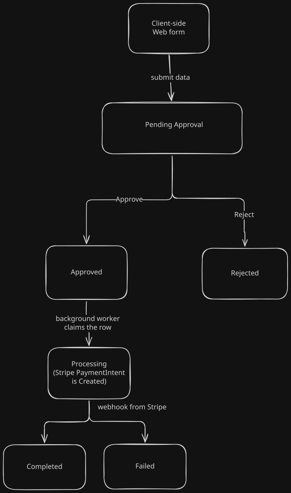
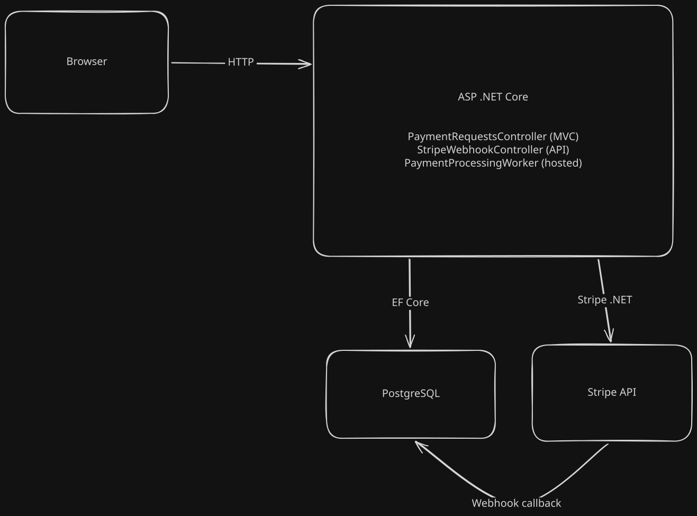

# PaymentFunds

An ASP.NET Core MVC application for submitting payment requests, routing them through an approval gate, and processing approved requests asynchronously against the Stripe API.

Built to work through the patterns real payment systems depend on: explicit state machines, idempotency at every retry boundary, asynchronous processing that survives restarts, and authenticated webhooks.

> **Test mode only.** This app runs against Stripe's test environment and has no authentication. See [Current limitations](#current-limitations).

---

## Table of contents

- [How it works](#how-it-works)
- [Tech stack](#tech-stack)
- [Architecture](#architecture)
- [Key design decisions](#key-design-decisions)
- [Getting started](#getting-started)
- [Running the tests](#running-the-tests)
- [Project structure](#project-structure)
- [Data model](#data-model)
- [Current limitations](#current-limitations)
- [Roadmap](#roadmap)

---

## How it works

A payment request moves through an explicit state machine. Nothing skips a step, and every transition is guarded server-side.



1. **Submit.** A user fills in amount, currency, and requester. The server mints an idempotency key when it renders the form, so resubmitting the same form cannot create a duplicate.
2. **Approve.** An approver approves or rejects. Both actions are recorded with a name and timestamp. Only `PendingApproval` requests can be acted on.
3. **Process.** A background worker polls for `Approved` rows every five seconds, claims one atomically, and calls Stripe through an `IPaymentProcessor` adapter. The request's idempotency key is forwarded to Stripe so a retry cannot double-charge.
4. **Settle.** Stripe calls back over a webhook when the payment resolves. The signature is verified, the event is deduplicated, and the request moves to `Completed` or `Failed`.

The web request never waits on Stripe. Approval returns immediately and the payment happens out of band.

---

## Tech stack

| Concern | Choice |
|---|---|
| Framework | ASP.NET Core 10 (MVC) |
| Database | PostgreSQL 16 |
| ORM | EF Core 10 with Npgsql |
| Payments | Stripe (Stripe.net 52.x) behind an `IPaymentProcessor` seam |
| Async processing | `BackgroundService` polling the database |
| Testing | NUnit 4 with `WebApplicationFactory` integration tests |
| Orchestration | Kubernetes (minikube locally) |
| Secrets (dev) | .NET User Secrets, sops for Kubernetes manifests |

---

## Architecture



The app has three independent entry points that never call each other:

- **HTTP from a person** reaches `PaymentRequestsController`.
- **A timer** drives `PaymentProcessingWorker`, which starts with the app and polls forever.
- **HTTP from Stripe** reaches `StripeWebhookController`.

They coordinate entirely through rows in Postgres. The `Status` column is the message: setting `Approved` posts a job, and the worker flipping it to `Processing` claims it. `StripePaymentIntentId` is the join key an inbound webhook uses to find the request it refers to.

---

## Key design decisions

### The database is the queue

Approved requests are not pushed onto an in-memory queue. The worker polls Postgres for rows in `Approved` state.

An in-memory queue (`System.Threading.Channels`) is the more common .NET answer and is simpler, but it lives in pod memory. A restart between "approved" and "paid" loses the work silently. Pods restart routinely in Kubernetes during rollouts, evictions, and node drains, so that failure mode is not acceptable for disbursements. Polling a durable table survives restarts with no extra infrastructure.

### Work is claimed atomically

```csharp
var claimed = await db.PaymentRequests
    .Where(pr => pr.Id == id && pr.Status == PaymentStatus.Approved)
    .ExecuteUpdateAsync(set => set.SetProperty(pr => pr.Status, PaymentStatus.Processing), ct);

if (claimed == 0) continue;
```

This compiles to a single `UPDATE ... WHERE`. Postgres evaluates the predicate under the row lock, so if two workers race, exactly one gets `1` back. This is what allows scaling to multiple replicas without paying anyone twice.

### Idempotency at all three boundaries

The same concept appears wherever a message can be retried:

| Boundary | Key | Enforced by |
|---|---|---|
| Browser → app | GUID minted when the form renders, carried in a hidden field | Pre-check plus a unique index on `IdempotencyKey` |
| App → Stripe | The same GUID, passed as `RequestOptions.IdempotencyKey` | Stripe replays the original response |
| Stripe → app | Stripe's event id | `ProcessedStripeEvents` table with a unique index |

On the inbound side, the pre-check handles the common case and the unique index closes the race the pre-check cannot. Application logic proposes; the database enforces.

### Webhook signatures are verified over the raw body

The handler reads `Request.Body` as a stream rather than binding to a model. Stripe signs the exact bytes it sent, so deserializing and re-serializing would shift whitespace and key order and break verification. A forged or altered payload gets a 400 and never touches a payment record.

### The payment provider sits behind an interface

The worker depends on `IPaymentProcessor`, not on Stripe:

```csharp
public interface IPaymentProcessor
{
    Task<PaymentResult> CreatePaymentAsync(PaymentInstruction instruction, CancellationToken ct);
}
```

No Stripe type appears in that signature. `PaymentInstruction` and `PaymentResult` are plain records, and `StripePaymentProcessor` is the only file in the app that references Stripe, translating `StripeException` into `PaymentResult.Failed` before it crosses the boundary.

This is what makes the worker testable. A fake processor can return a decline on demand, in milliseconds, with no network.

### Scoped services inside a singleton worker

`AddHostedService` registers the worker as a singleton, while `DbContext` is scoped. Injecting the context directly would leave one instance alive for the life of the process. The worker injects `IServiceProvider` and creates a scope per iteration instead. `IPaymentProcessor` is a singleton, so it is injected directly.

---

## Getting started

### Prerequisites

- [.NET 10 SDK](https://dotnet.microsoft.com/download)
- [minikube](https://minikube.sigs.k8s.io/docs/start) and `kubectl`
- [Stripe CLI](https://docs.stripe.com/cli)
- A Stripe account (test mode)

### 1. Start PostgreSQL in the cluster

```bash
minikube start
kubectl apply -f k8s/
kubectl get pods -w        # wait for 1/1 Running
```

Forward the database port so the app can reach it from your host. Leave this running.

```bash
kubectl port-forward svc/postgres 5432:5432
```

### 2. Configure secrets

```bash
dotnet user-secrets set "Stripe:SecretKey" "sk_test_..." --project src/PaymentFunds
```

The database connection string lives in `src/PaymentFunds/appsettings.Development.json` and matches the credentials in `k8s/postgres-secret.yaml`, which is encrypted with sops.

### 3. Apply migrations

```bash
ASPNETCORE_ENVIRONMENT=Development dotnet ef database update --project src/PaymentFunds
```

### 4. Start the webhook listener

In a separate terminal:

```bash
stripe listen --forward-to localhost:5245/api/stripe/webhook
```

Copy the `whsec_` secret it prints:

```bash
dotnet user-secrets set "Stripe:WebhookSecret" "whsec_..." --project src/PaymentFunds
```

> Restart the app after changing user secrets. Configuration binds at startup, so a running app keeps the old value.

### 5. Run

```bash
dotnet run --project src/PaymentFunds
```

Open <http://localhost:5245/PaymentRequests>.

---

## Running the tests

The integration tests hit a real PostgreSQL database rather than the EF InMemory provider. That is deliberate: the behaviour under test is database behaviour. InMemory does not enforce unique indexes, so the idempotency tests would pass against a broken application.

### One-time setup

With the port-forward running, create the test database:

```bash
psql -h localhost -p 5432 -U brandon -d PaymentFunds -c 'CREATE DATABASE paymentfunds_test'
```

### Run

```bash
dotnet test
```

Migrations are applied to the test database automatically on first run, and the tables are truncated between tests.

### What the tests cover

| Test | Asserts |
|---|---|
| `Forged_signature_is_rejected` | An invalid `Stripe-Signature` returns 400 and changes nothing |
| `Valid_event_moves_request_to_completed` | A correctly signed `payment_intent.succeeded` transitions the request |
| `Duplicate_event_is_recorded_once` | Replaying the same event id leaves exactly one `ProcessedStripeEvents` row |

`PaymentFundsFactory` boots the real application with three substitutions: the connection string points at `paymentfunds_test`, a known webhook signing secret is injected, and `IPaymentProcessor` is replaced with a fake. The background worker is removed via `RemoveAll<IHostedService>()` so it cannot mutate rows underneath assertions.

Webhook signatures are constructed in the tests using Stripe's own scheme, HMAC-SHA256 over `timestamp.payload`. This replaces manual replay with the Stripe CLI, which is bounded by a five-minute signature tolerance and sensitive to any reformatting of the payload bytes.

---

## Project structure

```
src/PaymentFunds/
  Controllers/
    PaymentRequestsController.cs   Create, approve, reject, list, details
    StripeWebhookController.cs     POST /api/stripe/webhook
  Data/
    ApplicationDbContext.cs        DbSets and unique indexes
  Models/
    PaymentRequest.cs              Core entity
    PaymentStatus.cs               State machine enum
    ProcessedStripeEvent.cs        Webhook deduplication ledger
    CreatePaymentRequestViewModel.cs
  Payments/
    IPaymentProcessor.cs           Provider-agnostic port
    PaymentInstruction.cs          What to pay
    PaymentResult.cs               What happened
    StripePaymentProcessor.cs      The only file that speaks Stripe
  Workers/
    PaymentProcessingWorker.cs     BackgroundService polling loop
  Views/PaymentRequests/           Razor views
  Migrations/                      EF Core migrations

tests/PaymentFunds.Tests/
  PaymentFundsFactory.cs           WebApplicationFactory with test overrides
  IntegrationTestBase.cs           Migration and truncation lifecycle
  StripeWebhookTests.cs            Signature, transition, deduplication
  PaymentProcessorTests.cs         Fake processor unit tests

k8s/                               PostgreSQL manifests (sops-encrypted secret)
```

---

## Data model

### PaymentRequest

| Column | Type | Notes |
|---|---|---|
| `Id` | int | Primary key |
| `IdempotencyKey` | string | Unique index; forwarded to Stripe |
| `Amount` | decimal | Converted to minor units for Stripe |
| `Currency` | string | Lowercase ISO code (`usd`, `eur`, `gbp`) |
| `Status` | enum | See state machine above |
| `RequestedBy` | string | Submitter |
| `ApprovedBy` / `ApprovedAt` | string? / DateTime? | Approval audit |
| `RejectedBy` / `RejectedAt` | string? / DateTime? | Rejection audit |
| `StripePaymentIntentId` | string? | Join key for incoming webhooks |
| `CreatedAt` / `ProcessedAt` | DateTime / DateTime? | |

### ProcessedStripeEvent

| Column | Type | Notes |
|---|---|---|
| `Id` | int | Primary key |
| `EventId` | string | Unique index; Stripe's event id |
| `EventType` | string | For example `payment_intent.succeeded` |
| `ProcessedAt` | DateTime | |

---

## Current limitations

Documented deliberately rather than hidden.

- **No authentication or authorization.** Anyone who can reach the app can approve any payment, and `ApprovedBy` is free text typed by whoever clicks the button. The approval gate is a UI convention, not an enforced control. Nothing prevents self-approval.
- **`PaymentIntent` is a charge, not a disbursement.** Stripe's `PaymentIntent` collects money. Real disbursement uses `Payout` or `Transfer` with Connect, which requires recipient onboarding and compliance handling.
- **Rows can strand in `Processing`.** A crash after claiming a row leaves it claimed with nothing to retry it. A sweeper is planned.
- **No payee model.** `RequestedBy` is a free-text string. There is no entity representing who gets paid, no payout destination, and no verification state.
- **No ledger or balance.** Nothing tracks whether funds are available to disburse, so insufficient funds is not a reachable state.
- **Coverage is thin.** The webhook boundary is well covered. The worker's polling and claiming logic and the create-form idempotency path are not yet.
- **`StripeConfiguration.ApiKey` is a global static.** `StripePaymentProcessor` reads it implicitly rather than receiving injected configuration.
- **The app is not containerized.** Only PostgreSQL runs in Kubernetes. The app runs on the host and reaches the database through `kubectl port-forward`.
